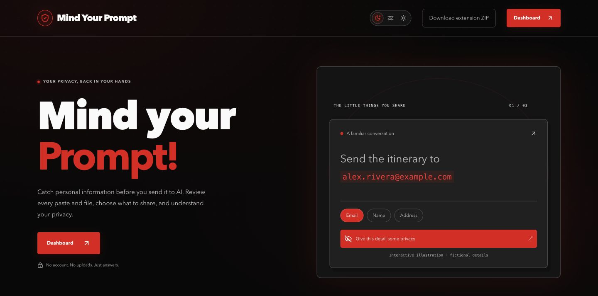
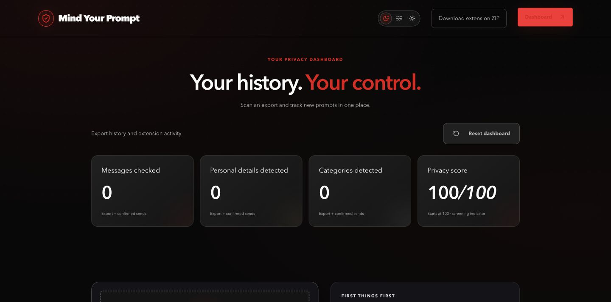

# Mind Your Prompt

**Look back at what you shared. Take control of what you send next.**

Mind Your Prompt is a privacy dashboard and Chrome extension for people who use AI. Scan a ChatGPT, Claude, or Gemini export on your own device, see the personal details it contains, and review sensitive information before sending your next prompt. Snowflake-powered policy answers help explain what providers say about retention, training, and deletion.

**[Live website](https://www.mindyourprompt.us) · [Dashboard](https://www.mindyourprompt.us/dashboard) · [Download extension](https://www.mindyourprompt.us/download/promptshield-extension.zip)**

Built for **ShellHacks 2026**. Some internal package names and the extension ZIP retain the original name, `PromptShield`.



## Team

- **Sai Sri Krishna Teja Sanku**
- **Rohith Vaka**
- **Jyothi Nandan**
- **Bhoomika Mudi**

## The problem

A resume, a support question, or a copied conversation can contain names, addresses, contact details, and credentials. Most people cannot easily audit what they have already shared across AI tools or check what a provider does with it. We connect that retrospective view with a decision at the moment of sharing.

## Sponsor challenge fit

| Challenge | What our implementation demonstrates |
| --- | --- |
| **Assurant — Take Control of AI** | Detect private details before sharing; choose replacement or original text; track disclosures in one dashboard. |
| **Microsoft — What’s Missing?** | AI-powered export auditing: upload → discover private details → review findings. The core task works without a chatbot or chat window. |
| **MLH / Snowflake — Best Use of Snowflake API** | Cortex Search retrieves official policy passages; Snowflake AI produces grounded privacy answers with source links. |

These are implementation-to-challenge mappings, not claims of sponsor endorsement or prize selection. The Microsoft demo is the standalone scan-and-review workflow; the optional policy question box is an additional feature.

## What you can do

### 1. Audit past conversations

Open **Dashboard**, choose your export, and scan it locally. No extension is required for this workflow.

| Provider | Supported input |
| --- | --- |
| ChatGPT | Conversation export ZIP or `conversations.json`. |
| Claude | Conversation ZIP/JSON containing `chat_messages`. A download manifest is not conversation history; download the archive it points to first. |
| Gemini | Google Takeout `MyActivity.json`, directly or in a ZIP. Recognized “Prompted” activity records are scanned; activity exports may not represent complete conversation threads. |

The website accepts ZIP/JSON files up to **200 MB**. It scans user-authored message text and builds a report with category counts, masked examples, a privacy score, timelines, and conversations worth reviewing. Assistant replies are not treated as your disclosures. Unsupported structures receive an error instead of fabricated results.

### 2. Review the next prompt

The Chrome extension supports ChatGPT, Claude, and Gemini. It checks typed text, pastes, and supported attachments locally. A stable popup shows checking progress, green when no details are found after checking, and red when findings need review.

You can inspect the detected value and category, use a placeholder, or choose **Send as is**. The original file is preserved when sharing unchanged. File replacement creates a plain-text file and does not preserve the original document layout.

### 3. Keep one dashboard



The dashboard combines an export report with subsequent confirmed extension sends:

- **Messages checked:** imported user messages plus confirmed live sends.
- **Personal details detected:** export findings plus details shared unchanged in tracked sends.
- **Categories detected:** the union of detected categories.
- **Privacy score:** starts at **100**, changes with findings, and has a minimum of 0.

Typing, cancelling a review, or attaching a file alone does not increase live totals. A matching sent message must appear in the conversation. Replaced details do not lower the live score.

Importing another export replaces the previous export report and starts a new live tracking window. Live activity from before that scan is excluded to reduce overlap; this is not exact cross-source deduplication. **Reset dashboard** clears the website report and live totals used by the website, not all extension settings or its separate history ledger.

### 4. Ask what happens to your data

Select a provider and ask a policy question in the dashboard. Snowflake retrieves relevant policy passages and generates an answer with sources. For example:

- “Is my chat used to train the model?”
- “How do I delete my conversations?”
- “What happens to this data?”
- “What can I do about it?”

These answers explain documented policies. They cannot determine whether a specific past conversation was used for training, and the app cannot delete provider-held data on your behalf.

## How it works

```mermaid
flowchart TD
    A[Chat export ZIP / JSON] --> B[Browser worker: parse user messages]
    B --> C[Local detection engine]
    D[Extension: text, paste, attachment] --> C
    C --> E[Rules + name dictionary + local NER]
    E --> F[Findings, placeholders, export report]
    F --> G[Unified website dashboard]
    D --> H[User reviews and sends]
    H --> I[Confirmed send: local aggregate totals]
    I --> G
    J[Policy question + provider + category names] --> K[Next.js server API]
    K --> L[Snowflake Cortex Search: policy passages]
    L --> M[Snowflake AI: grounded answer]
    M --> N[Answer with source links]
```



### Local AI and detection

The shared TypeScript engine combines deterministic patterns, validation where applicable, a first-name dictionary, and **Xenova/bert-base-NER** through **Transformers.js and ONNX Runtime Web**. NER identifies entities such as people and places that simple patterns may miss. Rules cover categories such as contact details, addresses, financial identifiers, and credentials.

Model assets download on first use and may be cached. In the website export worker, fast checks cover the user messages, while the AI pass is bounded to up to **400 recent eligible messages**. The UI reports model availability rather than pretending every scan used AI. Detection can miss details or flag harmless text.

### Scores are screening indicators

The export score uses weighted risk normalized by conversation count. Live scoring subtracts category-weighted penalties for personal details sent unchanged from the export score, or from 100 before an export exists. Scores are clamped at zero. A score of 100 before scanning is an initial state, not proof that data is safe.

Category conversation counts and total finding occurrences measure different things. One conversation may contain several findings and several categories. The report is not a count of every private word, nor an independently validated privacy rating.

### Snowflake RAG

Official policy sources are fetched, reviewed, chunked into the Snowflake knowledge base, and indexed by Cortex Search. The Next.js API retrieves passages and requests a grounded completion. The interface distinguishes Snowflake results from fallback data when the service is unavailable.

Relevant routes:

| Route | Purpose |
| --- | --- |
| `GET /api/tool-safety?tool=chatgpt` | Provider policy summary; inspect `source` to distinguish Snowflake from fallback. |
| `POST /api/ask` | Website policy questions with provider and category context. |
| `POST /api/privacy-question` | Extension policy questions. |

## Privacy and data boundaries

| Data | Where it goes |
| --- | --- |
| Uploaded chat export and detected values | Processed in the browser; not uploaded to our server for scanning. |
| Extension prompt/file analysis | Processed locally by the extension and shared engine. |
| Confirmed live activity shared with the website | Aggregate totals and category names through a restricted local extension bridge, not prompt text. |
| Policy question | Sent to our server and Snowflake with the selected provider and, for the website, category names. Do not include private values. |
| AI model assets | Downloaded to the device; scanning does not require sending the export to the model host. |
| A prompt you choose to send | Goes to the chatbot provider as part of its normal service. |

The extension keeps its activity/settings locally. The website's export report is held in the current tab; it is not a server-side account history. Browser network requests for app assets, model downloads, and policy questions are expected. Export uploads for analysis are not.

## Try it in three minutes

1. Open the [dashboard](https://www.mindyourprompt.us/dashboard). Verify the initial counts are zero and the score is 100.
2. Download this repository's [fictional export ZIP](fixtures/fake-export/fake-export.zip), then select it in the dashboard. Review the computed report and masked findings.
3. Select a provider and ask **“How do I delete my conversations?”** Review the answer and its sources.
4. Install the extension using the steps below. In a supported chatbot, enter this fictional test prompt:

   ```text
   My name is Alex Rivera. Please email the itinerary to alex.rivera@example.com.
   ```

5. Inspect the finding categories, then try **Replace and send**. Repeat with fictional details and **Send as is** to compare behavior. Dashboard live totals should update only after a confirmed send.
6. Try a plain-text attachment containing the same fictional information. Review it before choosing whether to share it. Use **Reset dashboard** to return the website counters to their starting state.

For a clean-text example:

```text
Explain how a rainbow forms in three short sentences.
```

Use only fictional information in demos. These are product test prompts, not secret model instructions. Load the local model once before presenting so the first download does not depend on venue Wi-Fi.

## Install the Chrome extension

1. [Download the ZIP](https://www.mindyourprompt.us/download/promptshield-extension.zip) and unzip it.
2. Open `chrome://extensions` and enable **Developer mode**.
3. Choose **Load unpacked** and select the extracted folder containing `manifest.json`.
4. Reload your ChatGPT, Claude, or Gemini tab and the website dashboard.

To update an existing installation, replace its unpacked files, click **Reload** in `chrome://extensions`, and refresh the chatbot tabs. Remove duplicate older copies. Refreshing the website alone does not update an unpacked extension.

## Run locally

### Prerequisites

- **Node.js 24+** and npm for the full monorepo, including the extension.
- Chrome for extension testing.
- Python 3 if generating fixtures or loading the Snowflake knowledge base.
- A configured Snowflake account for live policy retrieval; local export scanning does not need Snowflake credentials.

```bash
git clone https://github.com/krishnatejasai/ShellHacks_2026.git
cd ShellHacks_2026
npm ci
npm run dev
```

Open `http://localhost:3000`. On Windows PowerShell, use `npm.cmd` if execution policy blocks `npm.ps1`.

### Server configuration

Copy `apps/web/.env.example` to `apps/web/.env.local` and supply your own values:

```dotenv
SNOWFLAKE_ACCOUNT_URL=https://YOUR-ACCOUNT.snowflakecomputing.com
SNOWFLAKE_PAT=YOUR_PRIVATE_TOKEN
SNOWFLAKE_WAREHOUSE=PS_WH
SNOWFLAKE_ROLE=PROMPTSHIELD_APP
SNOWFLAKE_MODEL=claude-sonnet-4-5
WEB_ORIGIN=http://localhost:3000
```

Keep `.env.local` out of Git. The Snowflake token belongs only in server environment variables, never a `NEXT_PUBLIC_` or `VITE_` variable.

For knowledge-base provisioning, follow [Snowflake local setup](snowflake/LOCAL_SETUP.md) and the [refresh pipeline](snowflake/README.md). Setup scripts define the database/schema, access configuration, and search service; the loader's upload mode replaces knowledge-base table contents, so review its target before running it.

```bash
npm run check:env -w apps/web
npm run check:snowflake -w apps/web
```

### Build the extension

Create `apps/extension/.env.local` with the public API origin:

```dotenv
VITE_API_BASE_URL=http://localhost:3000
```

```bash
npm run build -w apps/extension
```

Load `apps/extension/.output/chrome-mv3` unpacked in Chrome. For the production download, build with `VITE_API_BASE_URL=https://www.mindyourprompt.us`, then ZIP the **contents** of that output folder into `apps/web/public/download/promptshield-extension.zip`. `manifest.json` must be at the ZIP root.

### Deploy the website

The project uses Vercel with **Root Directory `apps/web`** and the monorepo workspace dependencies. Add the server variables above to the Production environment, use the live origin for `WEB_ORIGIN`, and redeploy after environment changes. The public extension API origin is compiled into the extension and requires rebuilding its ZIP when changed.

After deployment, check the home page, `/dashboard`, the extension download, and `/api/tool-safety?tool=chatgpt`. A `source` of `snowflake` confirms that response used the Snowflake path; `fallback` is not proof of a successful live integration.

## Validation and test data

```bash
npm run typecheck
npm test
npm run test:person3
npm run build
```

The suites cover engine detection, export parsing/reporting, combined totals, extension send confirmation and file replay, and policy integration behavior. Automated fixtures do not replace manual checks against current signed-in chatbot interfaces.

The synthetic export is generated with Faker and a fixed seed. Its manifest records planted examples across 220 conversations, including **40 conversations with names, 23 with emails, 14 with addresses, and 9 with phone numbers**. These are category conversation counts, not a claim of perfect detection on real data.

```bash
python3 -m pip install -r scripts/requirements.txt
python3 scripts/generate_fake_export.py --as-of 2026-09-26
```

See [the fixture manifest](fixtures/fake-export/manifest.json) and [generator](scripts/generate_fake_export.py) for the reproducible test setup.

Before presenting, manually check typed text, paste, replace/send, send unchanged, and attachments on ChatGPT, Claude, and Gemini. Confirm the website's totals change only on sends, reset works, and Snowflake answers include relevant sources.

## Repository guide

```text
apps/web/             Next.js website, dashboard, workers, policy API routes
apps/extension/       WXT / Manifest V3 extension, guards, local activity
packages/engine/      Shared detection, NER, placeholders, file extraction
snowflake/            Policy sources, SQL setup, loading and connection checks
scripts/              Synthetic export generator
fixtures/             Fictional exports and policy/test fixtures
tests/                Cross-package integration and browser test harnesses
docs/                 Project notes and README screenshots
```

**Stack:** TypeScript, React, Next.js, WXT, Tailwind CSS, Framer Motion, Recharts, Transformers.js, ONNX Runtime Web, Snowflake Cortex Search/AI, Python, and Vercel.

## What we built and learned

We brought a shared detection engine into two workflows: reviewing historical exports and reviewing the next disclosure. We added parsers for three export families, local model execution, a unified report, confirmed-send tracking, placeholder replacement, file review, and a policy knowledge base. The interface combines a black/red visual theme with clear checking, safe-to-review, and warning states and reduced-motion support.

The hardest boundaries were distinguishing a draft from a sent message, avoiding duplicated activity when importing history, keeping scanning local while supporting remote policy questions, and replaying reviewed attachments into changing chatbot interfaces. Those boundaries shape both the implementation and the limitations below.

## Limitations and next steps

- Detection is best-effort, especially for unfamiliar names, international addresses, non-English text, and unusual file layouts. It is not a guarantee of anonymity.
- Exports must match supported structures. Gemini activity may be incomplete; a Claude manifest contains links rather than messages.
- Large exports have a bounded AI pass. Rules still run across the imported user text.
- Chatbot DOM changes can affect interception, upload readiness, and send confirmation. If automatic file sending cannot be confirmed, review the attachment and send manually.
- File replacement produces plain text. Preserving rich formatting is future work.
- Imported history and live activity use a time boundary, not perfect historical deduplication. Scores are heuristic screening indicators.
- Policy answers depend on source freshness, retrieval, service availability, and model grounding. Read the linked provider sources for consequential decisions.

Next steps include broader multilingual detection, more export formats, richer attachment redaction, stronger cross-source deduplication, and expanded real-browser regression coverage.
